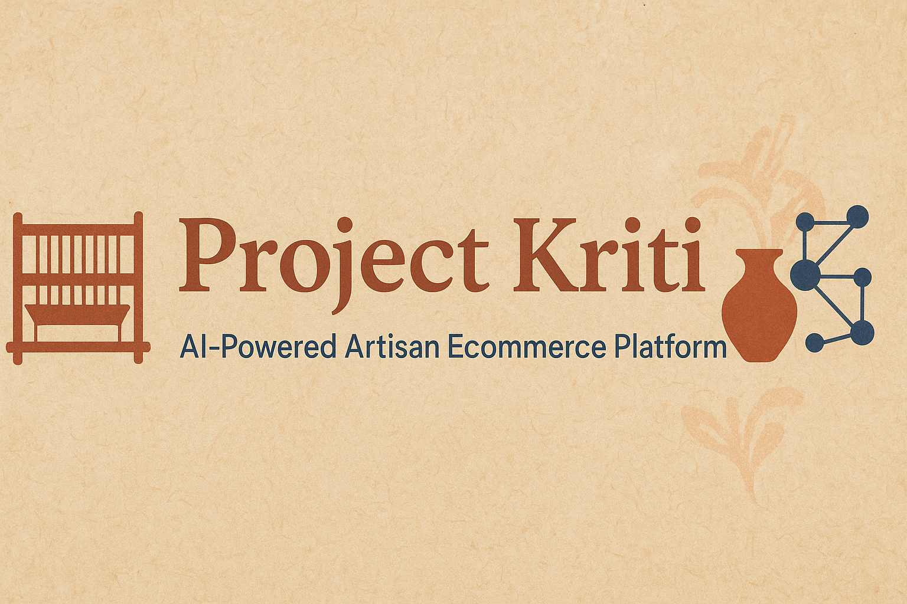

<<<<<<< HEAD
<p align="center">
  
</p>

<p align="center">
  
  
  
</p>

---

# 🌟 Project Kriti: AI-Powered Artisan Ecommerce Platform  

Welcome to **Project Kriti** – more than just an e-commerce platform. Kriti is a **digital home for artisans** and a **living museum of cultural heritage**.  
Our mission is simple yet profound: **to sell not just products, but the vibrant stories and traditions behind them.**  

---

## 🎯 Core Objective  
Preserve and empower cultural traditions by making each handmade product a **living story**.  

We achieve this by:  
- **Empowering Artisans**: Easy-to-use tools for selling, marketing, and growth.  
- **Engaging Customers**: Immersive shopping powered by AI-driven stories.  
- **Preserving Heritage**: Attaching cultural context and attribution to every product.  

---

## 🚀 Key Features  

✨ **AI-Powered Storytelling** – Each product comes with an AI-generated micro-documentary about the artisan, craft, and culture.  
🎁 **Personalized Discovery** – Intelligent recommendations help customers discover new artisans and traditions.  
📊 **Artisan Dashboard** – A simple portal to manage sales, earnings, and AI-generated marketing content (reels, descriptions, flyers).  
🛍️ **Virtual Bazaar** – An optional 3D marketplace where users can “walk through” artisan stalls.  
🌍 **Multilingual Support** – AI translation and narration make stories globally accessible.  
💙 **Impact Dashboard** – Buyers can track the real impact of their purchase on artisans and their communities.  

---

## 💻 Tech Stack  

Our stack is **modern, scalable, and serverless-first**:  

**Frontend**: Next.js + Tailwind CSS  
**Backend**: Firebase + Cloud Run  
**Database**: Firestore (real-time data) + BigQuery (analytics)  
**AI Layer**:  
- Vertex AI – Personalized recommendations & trend analysis  
- PaLM/Gemini – Storytelling & marketing content generation  
- Vision AI – Product image cleanup & background removal  
- TTS & Translation API – Multilingual storytelling  
**3D Support**: Three.js / Babylon.js (for Virtual Bazaar)  

---

## 🧱 Architecture & Core Modules  

Our system is built with modular **AI-driven agents**:  

- **interpreter.py 🧠** – Maps natural user intent (e.g., *“Show me wedding gifts”*) to categories & filters.  
- **designer.py 🎨** – Generates product/story schemas & synthetic data for dev/testing.  
- **mapper.py 🗺️** – Connects product data to cultural & artisan metadata.  
- **ingress_egress.py 📥📤** – Manages artisan submissions & report exports.  
- **certifier.py ✅** – Validates data & assigns **“Kriti Verified”** badges.  
- **app.py 🚀** – The orchestrator coordinating end-to-end workflows.  

---

## 📁 Project Structure  

kriti/
│── agents/ # Core AI-driven modules
│ ├── interpreter.py
│ ├── designer.py
│ ├── mapper.py
│ ├── ingress_egress.py
│ ├── certifier.py
│
│── tools/ # Utility scripts
│ ├── faker_generators.py
│ ├── transform_utils.py
│
│── config/ # Config & schema files
│ ├── use_case_map.json
│ ├── mapping_rules.json
│ ├── schemas/
│
│── database/ # Local dev database
│ ├── kriti.db
│ ├── init.sql
│
│── app.py # Main orchestrator
│── README.md # Documentation
│── requirements.txt # Python dependencies


---

## 📦 Getting Started  

Clone the repository:  
```bash
git clone https://github.com/your-username/kriti.git
cd kriti

Create & activate a virtual environment:
python -m venv venv
source venv/bin/activate   # On Windows: venv\Scripts\activate


Install dependencies:
pip install -r requirements.txt


Run the application in simulation mode:
python app.py


You’ll be prompted with a question like:
👉 “What are you looking for?”
Kriti will then generate a product card + story powered by its AI agents.

🤝 Contribution

We ❤️ open-source collaboration!
Check out our CONTRIBUTING.md
 to see how you can help build Kriti into a thriving platform for artisans worldwide.

🙏 Acknowledgments

A heartfelt thanks to the artisans who dedicate their lives to preserving cultural traditions.
Project Kriti is for you. 💙

📌 Project Status

🚧 Active Development – Features are being added continuously.
⭐ Star this repo to follow our journey!


---

✅ Just make sure:  
- Place your `banner.png` in an `assets/` folder at the root of your repo.  
- Copy this entire README content into `README.md`.  

Would you like me to also add a **“Demo GIF / Screenshot Section”** placeholder in the README so that once you build the UI, you can show live previews of Kriti?

=======
🌟 Project Kriti: AI-Powered Artisan Ecommerce Platform
Welcome to Project Kriti! We are building more than just an ecommerce platform; we are creating a digital home for artisans and a living museum for cultural heritage. Kriti's mission is to fuse marketplace functionality with AI-driven storytelling, personalized discovery, and artisan empowerment. Our goal is simple yet profound: to sell not just products, but the vibrant stories and traditions behind them.

🎯 Core Objective
To preserve and empower cultural traditions by making each handmade product a living story.

We do this by:

Empowering Artisans: Providing easy-to-use tools for selling and marketing.

Engaging Customers: Creating immersive shopping experiences with rich, AI-generated stories.

Preserving Heritage: Attaching cultural context and attribution to every single product.

🚀 Key Features
AI-Powered Storytelling: Each product comes with an AI-generated micro-documentary, providing context about the artisan, their craft, and its cultural significance.

Personalized Discovery: Our AI-powered feed learns what you love and recommends new crafts and artisans, just for you.

Artisan Dashboard: A simple, powerful portal for artisans to manage sales, track earnings, and use our AI Marketing Studio to create content (reels, descriptions, flyers).

Virtual Bazaar: An optional, immersive 3D marketplace that allows users to "walk through" and explore artisan stalls.

Multilingual Support: AI-driven translation and text-to-speech narration make our stories accessible to a global audience.

Impact Dashboard: Buyers can see the direct impact of their purchase on the artisan and their community.

💻 Tech Stack
Kriti is built with a modern, scalable, and serverless-first approach.

Frontend: Next.js & Tailwind CSS for a blazing-fast, responsive user interface.

Backend: Firebase & Cloud Run for a robust and scalable serverless architecture.

Database: Firestore for real-time product/artisan data and BigQuery for powerful analytics.

AI Layer: We leverage Google's cutting-edge AI services:

Vertex AI: For personalized recommendations and trend analysis.

PaLM/Gemini: For generating compelling product stories and marketing content.

Vision AI: For cleaning up product images and background removal.

TTS & Translation API: To bring our stories to life in multiple languages.

Three.js / Babylon.js: (Optional) For the 3D Virtual Bazaar.

🧱 Architecture & Modules
Our architecture is designed with modularity in mind, using a system of independent agents that work together to create the Kriti experience.

interpreter.py 🧠: The Brain. Maps natural user intent (e.g., "Show me wedding gifts") to product categories and filters.

designer.py 🎨: The Creator. Generates product and story schemas, creating rich, synthetic data for development and testing.

mapper.py 🗺️: The Connector. Links product data to cultural and artisan metadata, ensuring every piece has a story.

ingress_egress.py 📥📤: The Gatekeeper. Manages the flow of data, from batch ingestion of artisan submissions to the export of reports and product data.

certifier.py ✅: The Guardian. Validates all data for completeness and trustworthiness, assigning a "Kriti Verified" badge to products and artisans.

app.py 🚀: The Orchestrator. The main script that coordinates the entire flow, from a user's prompt to a marketplace-ready product card.

📁 Project Structure
kriti/
│── agents/             # Core logic split by roles
│   ├── interpreter.py
│   ├── designer.py
│   ├── mapper.py
│   ├── ingress_egress.py
│   ├── certifier.py
│
│── tools/              # Utility scripts and helpers
│   ├── faker_generators.py
│   ├── transform_utils.py
│
│── config/             # Configuration files
│   ├── use_case_map.json
│   ├── mapping_rules.json
│   ├── schemas/
│
│── database/           # Local database for dev/simulation
│   ├── kriti.db
│   ├── init.sql
│
│── app.py              # Main application file
│── README.md           # This file!
│── requirements.txt    # Python dependencies
📦 Getting Started
To get the project up and running locally, follow these simple steps.

1. Clone the repository
Bash

git clone https://github.com/your-username/kriti.git
cd kriti
2. Set up the environment
We recommend using a virtual environment to manage dependencies.

Bash

# Create and activate a virtual environment
python -m venv venv
source venv/bin/activate  # On Windows, use `venv\Scripts\activate`

# Install dependencies
pip install -r requirements.txt
3. Run the application
The app.py script orchestrates the entire workflow. You can run it in simulation mode to see how the agents work together.

Bash

python app.py
This will prompt you with a question like "What are you looking for?" and a product card with a story will be generated based on your input!

🤝 Contribution
We welcome contributions from the community! If you'd like to help us build this beautiful platform, please check out our CONTRIBUTING.md file for guidelines.

🙏 Acknowledgment
A special thanks to the countless artisans who dedicate their lives to preserving these incredible traditions. We are building Kriti for you.# KRITI
# KRITI
>>>>>>> ddf726e3010bd9c50732bcfa9e4c234342a3334b
